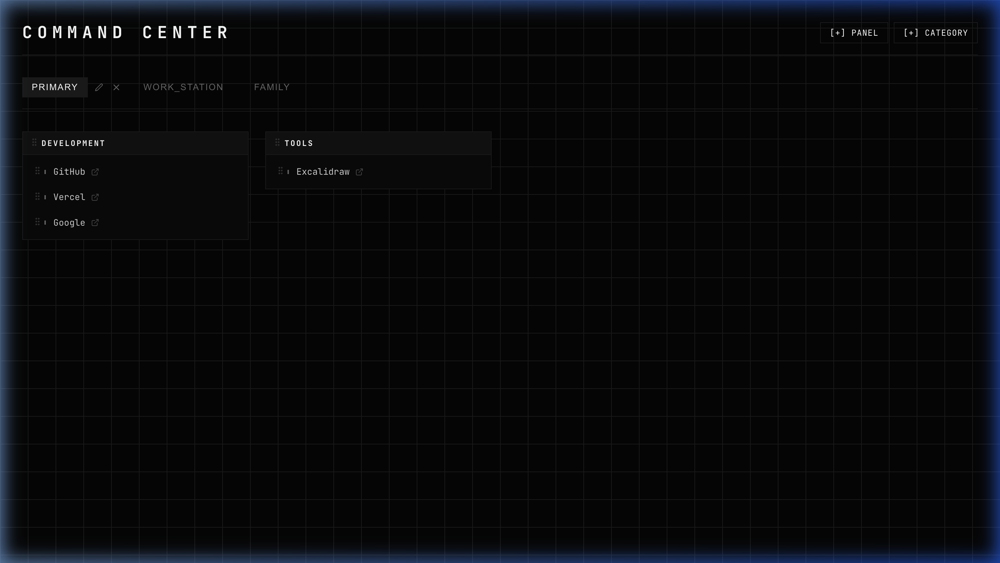

# Command Center | Personal Link Dashboard



A high-density, high-contrast personal dashboard designed for efficiency and a modern "technical command center" aesthetic.

> [!NOTE]
> This project was entirely designed, implemented, and recovered by **Antigravity**, an AI Coding Agent, in collaboration with the user. Every line of code, the database schema, and the custom CSS "Neon Ghost" styling was generated and refined through an agentic workflow.

## 🛠 Tech Stack

### Frontend
- **React 18** + **Vite**: For a lightning-fast development experience and modular component architecture.
- **Vanilla CSS**: Custom styling system featuring a "Neon Ghost" aesthetic, monospace typography, and a technical grid background.
- **dnd-kit**: Robust drag-and-drop system for reordering categories and links.
- **Lucide React**: Clean, consistent technical iconography.
- **Axios**: Efficient API communication.

### Backend
- **Node.js** & **Express**: Lightweight API server.
- **Better-SQLite3**: Fast, synchronous SQLite database for seamless local persistence.
- **Database Schema**: 3-tier hierarchy (Panels -> Categories -> Links) with cascading deletes and display order tracking.

## ✨ Key Features

- 🖥 **Command Center UI**: A focused, high-density layout using monospace fonts and subtle glow effects.
- 📂 **Panel Management**: Create, rename, and switch between multiple "Panels" (e.g., Work, Personal, Learning).
- 🧱 **Modular Block Structure**: Categories are rendered as compact blocks in a responsive grid.
- 🖱 **Drag-and-Drop Reordering**: 
    - Reorder entire Categories.
    - Reorder Links within a category.
    - Move Links between different categories.
- 👻 **Neon Ghost Link Style**: High-contrast silver links that glow white with a cyan accent line on hover.
- 💾 **Local Persistence**: All changes are saved automatically to a local SQLite database.

## 🚀 Getting Started

### 1. Backend Setup
```bash
cd server
npm install
node index.js
```
*The server runs on http://localhost:3001*

### 2. Frontend Setup
```bash
cd client
npm install
npm run dev
```
*The dashboard will be available at http://localhost:5173 (or the next available port)*

## 📂 Project Structure

- `/client`: React frontend source code and styles.
- `/server`: Node.js/Express API and SQLite database management.
- `dashboard.db`: The local SQLite database file (generated on first run).
